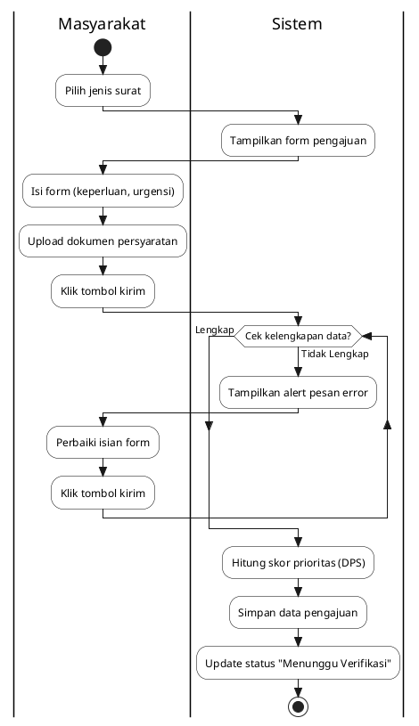
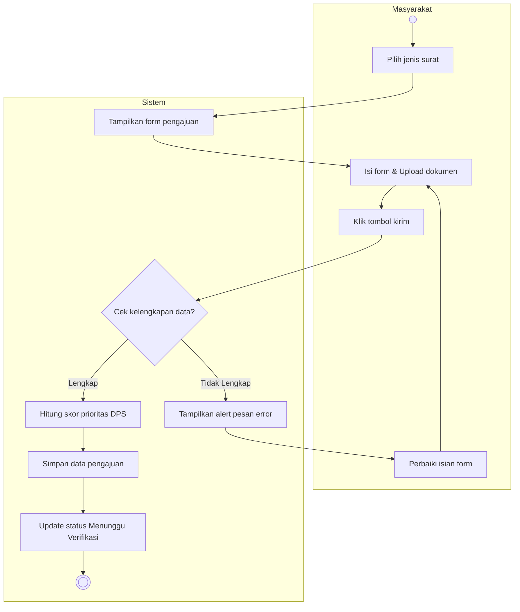
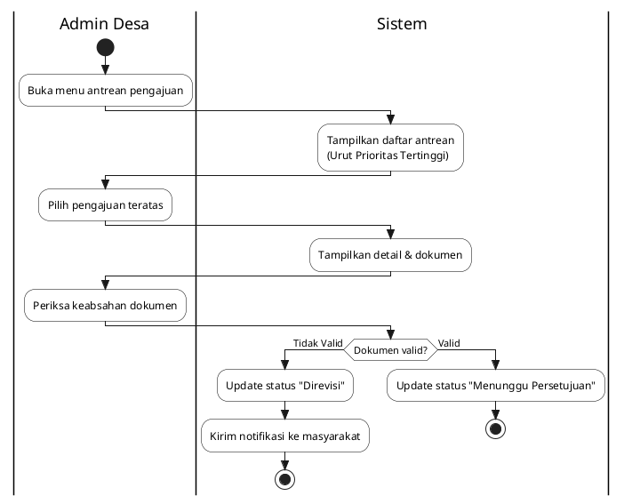
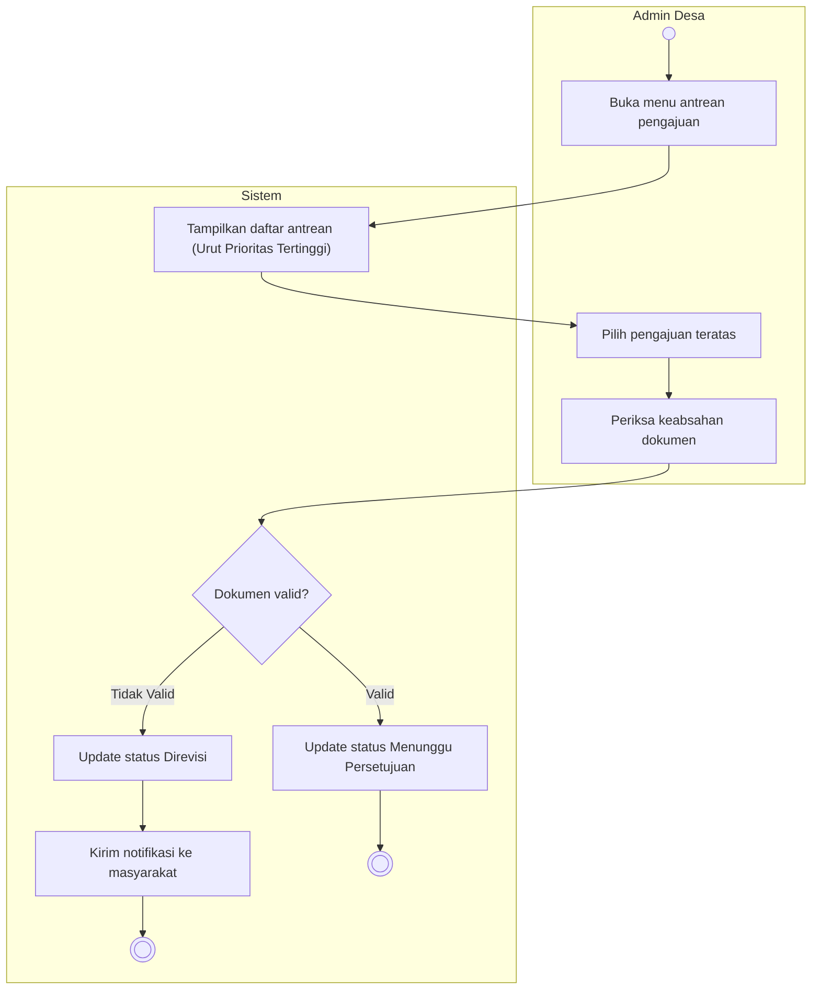
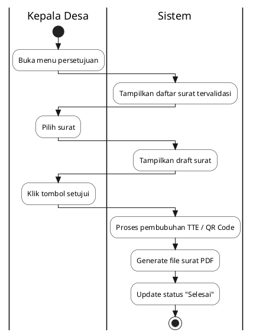
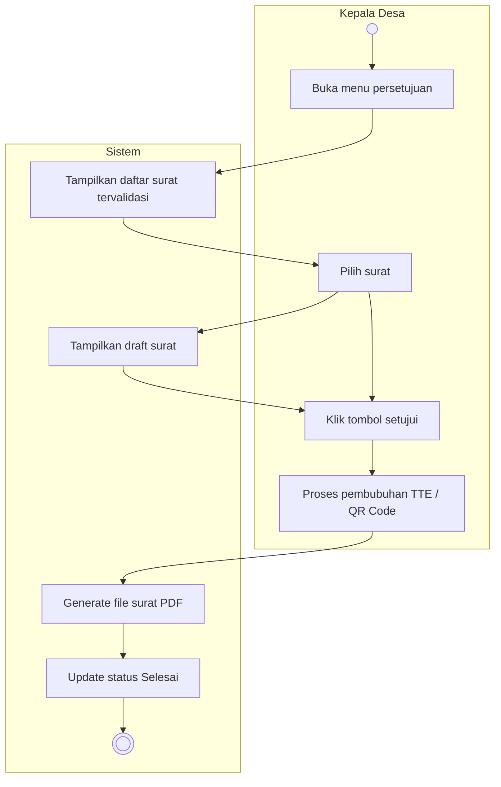
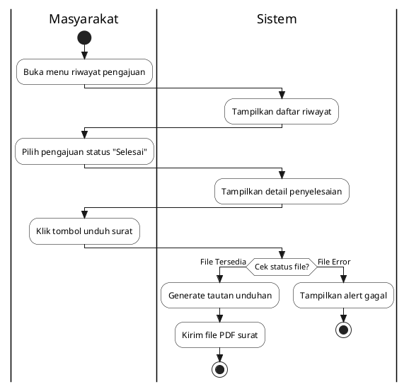
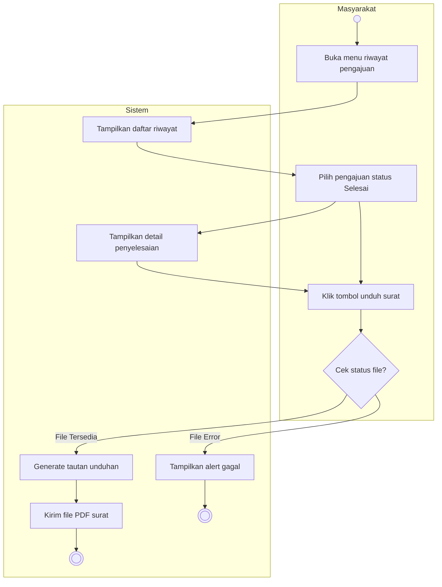

# 4.3 Hasil Pengembangan Sistem

Sub-bab ini menguraikan hasil rancangan sistem SIAPS-APP yang dibangun berdasarkan hasil analisis dan pemodelan sebelumnya. Salah satu instrumen penting untuk memvisualisasikan alur kerja sistem adalah *Activity Diagram*.

## 4.3.1 Activity Diagram

*Activity Diagram* menggambarkan alur kerja (*workflow*) atau aktivitas dari sebuah sistem atau proses bisnis. Pada pemodelan ini, *activity diagram* dirancang secara sederhana menggunakan dua *swimlane* utama yang mewakili interaksi antara **Aktor (Pengguna)** dan **Sistem**.

Berikut adalah rancangan *activity diagram* untuk 4 modul utama dalam sistem SIAPS-APP (selain modul Login):

---

### 1. Activity Diagram Modul Pengajuan Surat

Modul ini menjelaskan alur saat masyarakat melakukan permohonan pembuatan surat baru. Di sinilah parameter algoritma *Priority Scheduling* mulai dicatat oleh sistem.

**Penjelasan Alur:**
Masyarakat memilih jenis surat, lalu sistem menampilkan form. Masyarakat mengisi data dan tingkat urgensi, lalu mengunggah berkas. Sistem melakukan validasi; jika tidak lengkap, akan dikembalikan ke masyarakat. Jika lengkap, sistem menghitung skor prioritas awal dan menyimpan pengajuan.

**Kode PlantUML:**

**Kode Mermaid:**

---

### 2. Activity Diagram Modul Verifikasi Pengajuan

Modul ini menggambarkan alur kerja Admin Desa dalam memverifikasi berkas yang masuk, dengan memanfaatkan urutan antrean yang telah diolah oleh algoritma DPS.

**Penjelasan Alur:**
Admin membuka menu antrean. Sistem menampilkan daftar pengajuan yang sudah terurut berdasarkan skor prioritas tertinggi. Admin memilih pengajuan teratas dan memeriksa dokumen. Jika dokumen tidak valid (salah/buram), admin menolak dan sistem mengirim notifikasi revisi ke masyarakat. Jika valid, sistem mengupdate status ke "Menunggu Persetujuan".

**Kode PlantUML:**

**Kode Mermaid:**

---

### 3. Activity Diagram Modul Persetujuan Surat (Tanda Tangan)

Modul ini menjelaskan alur persetujuan akhir oleh Kepala Desa sebelum surat dicetak atau diterbitkan secara digital.

**Penjelasan Alur:**
Kepala Desa membuka menu persetujuan. Sistem menampilkan daftar surat yang telah diverifikasi oleh admin. Kepala Desa melihat *draft* surat, lalu menekan tombol setujui. Sistem memproses persetujuan (pembubuhan TTE/QR Code), mengenerate file PDF surat, dan mengubah status menjadi "Selesai".

**Kode PlantUML:**

**Kode Mermaid:**

---

### 4. Activity Diagram Modul Pengunduhan/Pengambilan Surat

Modul ini menggambarkan alur ketika masyarakat ingin mengunduh atau mengambil surat yang telah selesai diproses.

**Penjelasan Alur:**
Masyarakat membuka menu riwayat pengajuan. Sistem menampilkan status dokumen. Masyarakat memilih pengajuan berstatus "Selesai", lalu menekan tombol unduh. Sistem melakukan verifikasi status, mengenerate tautan unduhan, dan memberikan file PDF kepada masyarakat.

**Kode PlantUML:**

**Kode Mermaid:**

---

### Panduan Pembuatan Manual untuk Anda:
Jika Anda ingin menyalin atau membuat ulang diagram ini agar persis seperti gambar referensi Anda menggunakan **Draw.io** atau **Visual Paradigm**:

1.  **Buat Swimlane**: Tarik komponen *Vertical Pool/Swimlane*, bagilah menjadi dua kolom utama: **Kolom Kiri (Nama Aktor: Masyarakat/Admin/Kades)** dan **Kolom Kanan (Sistem)**.
2.  **Mulai (Start Node)**: Gunakan lingkaran hitam penuh di kolom Aktor untuk memulai alur.
3.  **Aktivitas**: Gunakan kotak dengan sudut membulat (*Rounded Rectangle*) untuk setiap aksi. Pastikan menaruhnya di kolom yang tepat (Aksi manusia di kolom Aktor, proses komputer di kolom Sistem).
4.  **Percabangan (Decision)**: Gunakan bentuk belah ketupat (*Diamond*) di kolom Sistem untuk pengecekan seperti "Cek stok buku" atau "Cek kelengkapan dokumen".
5.  **Garis Panah**: Hubungkan setiap aktivitas secara sekuensial. Jika kondisi pada *Diamond* adalah "Tidak Lengkap/Habis", tarik panah ke kiri (ke kolom Aktor) untuk menampilkan aksi perbaikan atau *alert*. Jika "Lengkap/Valid", tarik panah ke bawah untuk melanjutkan proses di sistem.
6.  **Selesai (End Node)**: Gunakan lingkaran hitam bergaris tepi ganda di kolom Sistem untuk menandakan proses berakhir.
