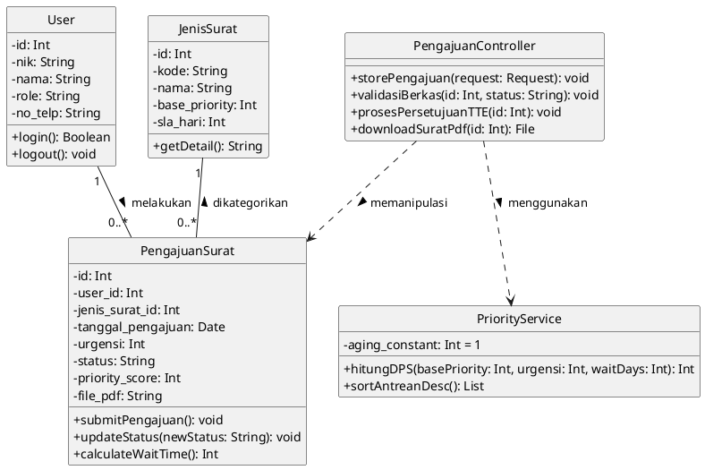
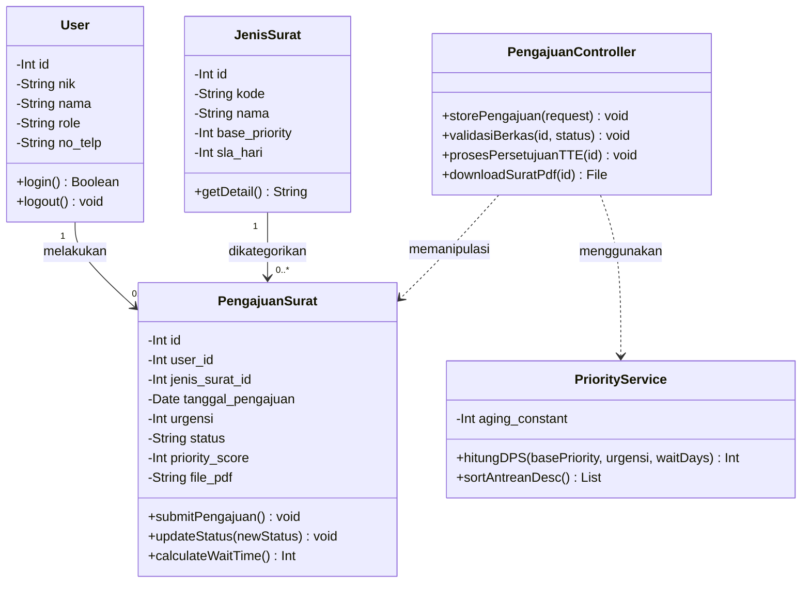

## 4.3.3 Class Diagram

*Class Diagram* adalah pemodelan visual yang menggambarkan struktur sistem dari segi pendefinisian kelas-kelas (*classes*), beserta atribut (*attributes*), operasi atau metode (*methods*), dan hubungan relasi antar kelas tersebut. 

Untuk mengakomodasi keempat modul utama (Pengajuan, Verifikasi, Persetujuan, dan Pengunduhan) serta logika algoritma *Dynamic Priority Scheduling* (DPS), sistem SIAPS-APP dirancang menggunakan beberapa kelas utama yang merepresentasikan entitas basis data maupun kelas pengontrol (*controller/service*).

Berikut adalah rancangan *Class Diagram* untuk sistem SIAPS-APP:

### 1. Rancangan Diagram
Diagram di bawah ini mencakup *class* `User` (merepresentasikan entitas masyarakat, admin, dan kades), `PengajuanSurat`, `JenisSurat`, `PriorityService` (untuk algoritma DPS), serta `PengajuanController` yang mengatur logika alur kerjanya.

**Kode PlantUML:**

**Kode Mermaid JS:**

---

### Panduan Pembuatan Manual Class Diagram (Untuk Visio/Draw.io):

Berdasarkan referensi gambar standar UML Anda, berikut adalah cara merangkai diagram ini secara manual:

1.  **Simbol Kelas (Kotak 3 Baris)**: Gunakan simbol *Class* yang memiliki 3 sekat horizontal.
    *   **Baris Atas (Name)**: Tulis nama kelas dengan cetak tebal (bold) di tengah, contoh: **PengajuanSurat**.
    *   **Baris Tengah (Attributes)**: Tuliskan variabel data. Gunakan tanda minus (`-`) di depannya untuk menandakan hak akses *private*, diikuti tipe datanya (contoh: `- urgensi: Int`).
    *   **Baris Bawah (Operations/Methods)**: Tuliskan fungsi atau *behavior*. Gunakan tanda plus (`+`) untuk akses *public* beserta parameternya (contoh: `+ updateStatus(newStatus: String)`).
2.  **Relasi Garis**:
    *   **Asosiasi (Garis Solid biasa)**: Hubungkan antara entitas `User` dengan `PengajuanSurat`. Tambahkan kardinalitas `"1"` di dekat `User` dan `"0..*"` di dekat `PengajuanSurat` yang mengartikan "Satu user bisa memiliki banyak pengajuan".
    *   **Dependency / Ketergantungan (Garis Putus-putus dengan Panah)**: Tarik dari `PengajuanController` menuju `PriorityService` dan `PengajuanSurat`. Ini menandakan bahwa *Controller* tersebut memerlukan kelas lain untuk bisa bekerja (memanggil fungsi perhitungan algoritma).
3.  **Tipe Data Tambahan**: Pastikan penulisan tipe data seperti `Int`, `String`, `Date`, atau `Boolean` diawali huruf kapital agar sesuai kaidah penulisan OOP baku seperti di referensi gambar Anda.
