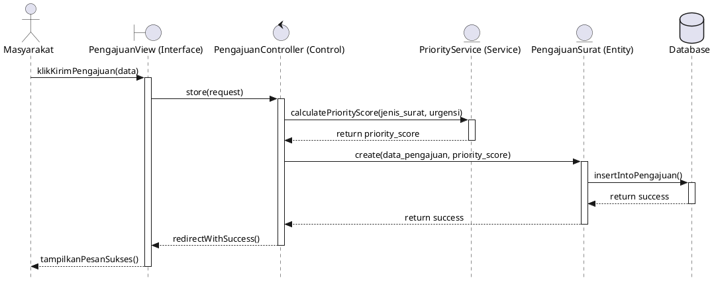
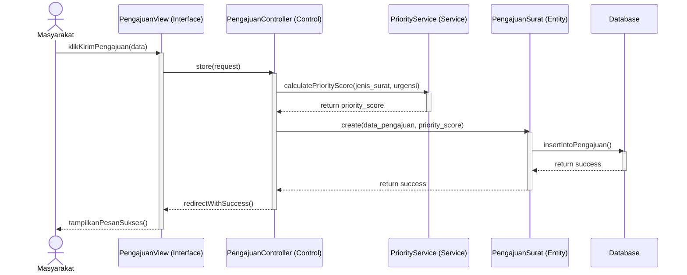
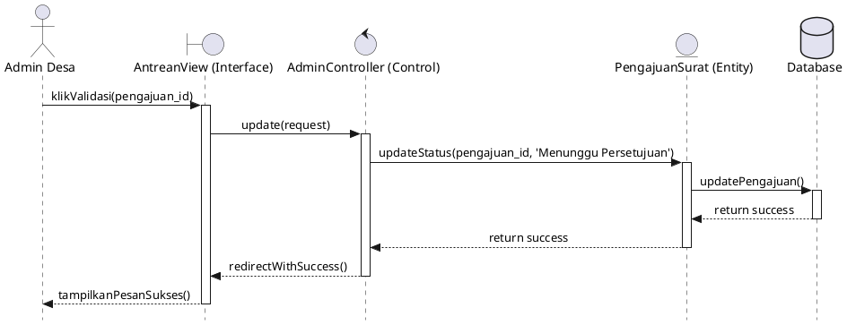
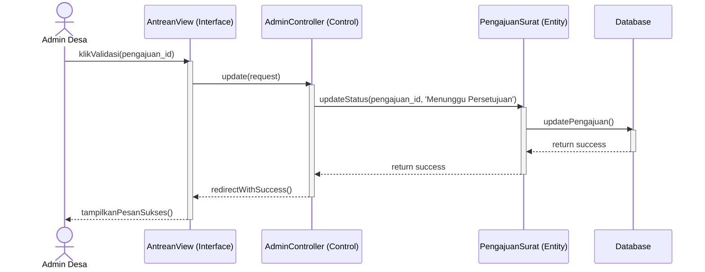
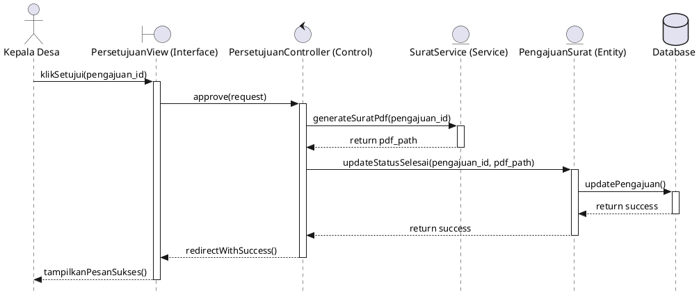
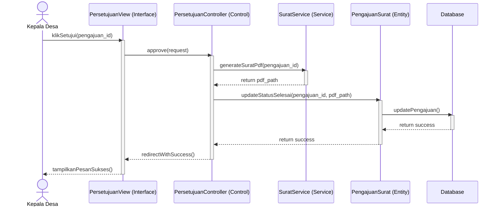
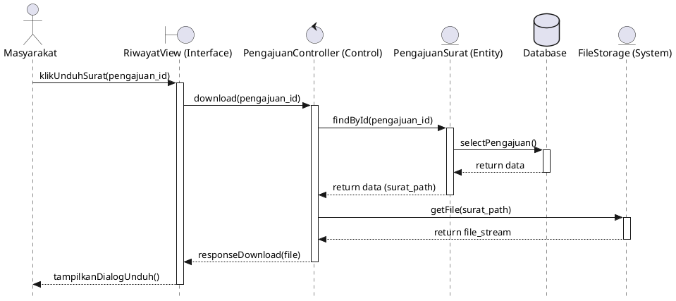
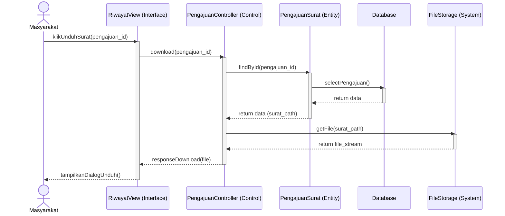

## 4.3.2 Sequence Diagram

*Sequence Diagram* digunakan untuk menggambarkan kelakuan objek dalam sebuah use case dengan mendeskripsikan waktu hidup objek dan pesan yang dikirimkan serta diterima antar objek. Berdasarkan pola arsitektur *Model-View-Controller* (MVC) yang digunakan pada SIAPS-APP, diagram ini memetakan interaksi antara *Actor*, *Boundary/View* (Antarmuka), *Control* (Controller), *Entity* (Model/Service), dan *Database*.

Berikut adalah *Sequence Diagram* untuk 4 modul utama pada SIAPS-APP (mengikuti referensi standar UML):

---

### 1. Sequence Diagram Modul Pengajuan Surat

Modul ini mendeskripsikan interaksi dari sisi masyarakat ketika mengirimkan form pengajuan. Sistem akan memanggil layanan khusus (*PriorityService*) untuk menghitung algoritma *Dynamic Priority Scheduling* (DPS) sebelum menyimpannya ke *database*.

**Kode PlantUML (Sesuai Referensi Gambar):**

**Kode Mermaid JS:**

---

### 2. Sequence Diagram Modul Verifikasi Pengajuan

Diagram ini memperlihatkan interaksi Admin Desa dalam memvalidasi berkas masyarakat dari daftar antrean yang telah diurutkan oleh algoritma.

**Kode PlantUML:**

**Kode Mermaid JS:**

---

### 3. Sequence Diagram Modul Persetujuan Surat

Modul ini berfokus pada peran Kepala Desa yang menyetujui surat. Proses ini melibatkan pemanggilan fungsi untuk membubuhkan Tanda Tangan Elektronik (TTE) dan membuat *file* PDF surat resmi.

**Kode PlantUML:**

**Kode Mermaid JS:**

---

### 4. Sequence Diagram Modul Pengunduhan Surat

Modul ini menggambarkan cara sistem merespons permintaan masyarakat yang ingin mengambil atau mengunduh *file* PDF surat yang telah selesai.

**Kode PlantUML:**

**Kode Mermaid JS:**

---

### Panduan Pembuatan Manual Sequence Diagram (Untuk Visio/Draw.io):

Berdasarkan referensi gambar Anda, elemen-elemen yang wajib ada saat menggambar secara manual adalah:
1.  **Actor (Bentuk Orang)**: Tarik *actor* ke ujung paling kiri, beri nama peran (misal: Masyarakat, Admin).
2.  **Boundary / Interface (Bentuk Kotak)**: Menandakan antarmuka yang dilihat pengguna (Contoh: `PengajuanView`).
3.  **Control (Bentuk Kotak)**: Menandakan logika program di controller (Contoh: `PengajuanController`).
4.  **Entity (Bentuk Kotak)**: Menandakan model atau data memori (Contoh: `PengajuanSurat` / `PriorityService`).
5.  **Database (Bentuk Kotak / Silinder)**: Menandakan penyimpanan permanen.
6.  **Lifeline (Garis Putus-putus ke bawah)**: Berasal dari bawah setiap kotak/actor.
7.  **Activation Box (Kotak Vertikal Panjang di Lifeline)**: Menandakan objek sedang bekerja/aktif memproses metode. Di gambar Anda, kotak abu-abu ini terlihat sangat jelas di setiap garis panah yang masuk.
8.  **Pesan Pemanggilan / Request (Garis Solid dengan Panah Penuh $\rightarrow$)**: Contoh `store(request)`, `insertIntoBookings()`. Sertakan nomor urutan pesan (1, 2, 3...) dalam bentuk lingkaran hitam seperti pada gambar.
9.  **Pesan Kembalian / Return (Garis Putus-putus dengan Panah Terbuka $\dashrightarrow$)**: Contoh `return success`, `tampilkanPesanSukses()`.
